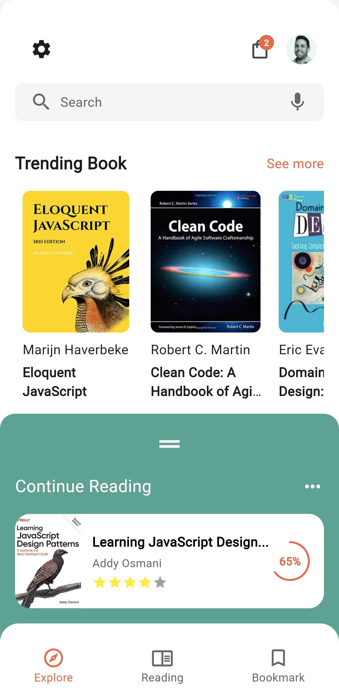
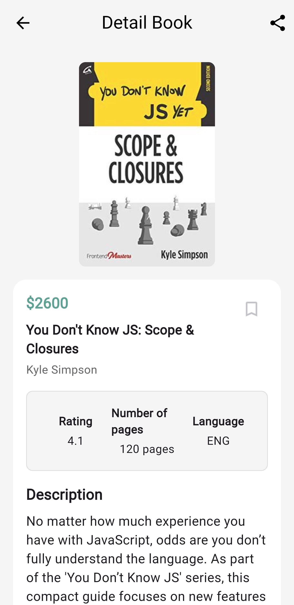

# eBooktify

## Descripción.

eBooktify es una tienda de eBooks desarrollada con Flutter, que ofrece una experiencia rápida y fluida en dispositivos móviles. Implementa la arquitectura BLoC junto con el patrón MVVM para garantizar un código modular, escalable y fácil de mantener. La aplicación se conecta de forma segura con Firebase a través de una API REST utilizando la biblioteca Dio para la gestión de peticiones HTTP. Además, cuenta con un sistema de administración (CRUD) que permite agregar, editar y eliminar libros mediante la misma API REST, facilitando la gestión del catálogo digital. 

Esta aplicación fue creada como proyecto final para un curso avanzado de Flutter

## Algunas capturas de pantalla.

| Principal | Más libros | Detalle | Carro de compra |
|-----------|-----------|-----------|-----------|
|||||

## LLMs utilizados:

- **Claude 3.5 Sonnet**: Programación BLoC.
- **DeepSeek V3**: Implentación patrón MVVM.

## Ver vídeo de la aplicación.

